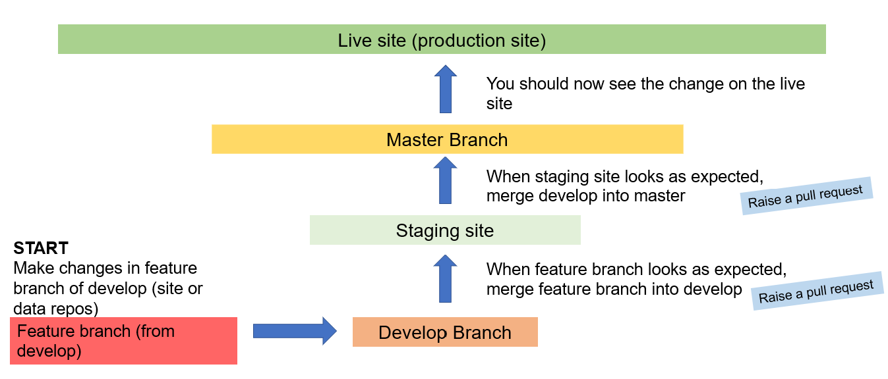

# Open SDG Rwanda - Site Repository

This staging **site repository** is part of the implementation of the [Open SDG](https://github.com/open-sdg/open-sdg) platform for Rwanda. 

The production version of the SDG reporting site for Rwanda can be found at https://sustainabledevelopment-rwanda.github.io/.

This repository deploys to the staging version of the SDG reporting site for Rwanda, which can be found at https://sustainabledevelopment-rwanda.github.io/sdg-site-rwanda/.

Open SDG is an open source, free-to-reuse platform for managing and publishing data and statistics related to the UN Sustainable Development Goals (SDGs). Many relevant details can be found in the [Open SDG Documentation](https://open-sdg.readthedocs.io/en/latest/). 

However, this repository does not use the most recent version of Open SDG and has some custom features, so not all of the Open SDG documentation is accurate to this version. More details specific to this version are provided below.

# Structure

## Repositories

In total, four repositories are involved in the Open SDG implementation. These are divided into two categories.

**Staging repositories**
- Staging data repository: [sdg-data-rwanda](https://github.com/sustainabledevelopment-rwanda/sdg-data-rwanda) 
- Staging site repository: [sdg-site-rwanda](https://github.com/sustainabledevelopment-rwanda/sdg-site-rwanda) **(you are here!)**

**Production repositories**
- Production data repository: [sdg-data-prod](https://github.com/sustainabledevelopment-rwanda/sdg-data-prod)
- Production site repository: [sustainabledevelopment-rwanda.github.io](https://github.com/sustainabledevelopment-rwanda/sustainabledevelopment-rwanda.github.io)

Two other repositories in this organization, [sdg-indicators-archived](https://github.com/sustainabledevelopment-rwanda/sdg-indicators-archived) and [sdg-data-archived](https://github.com/sustainabledevelopment-rwanda/sdg-data-archived), are archived and no longer in use.

## Deployment

The repositories described in the previous section are linked in the deployment process.

### Data service

The **data repositories** are used to hold and update data for SDG reporting. 

The `develop` branch of the data repository serves from the `gh-pages` branch of the data repository.

It deploys to the **data service** at https://sustainabledevelopment-rwanda.github.io/sdg-data-rwanda/.

It usually takes around 5 minutes after an update is merged to the data repository for the deployment to take place.

In the standard implementation of Open SDG, the data site is used to upload data updates directly. In this implementation, it is not used for this purpose, but is still used to hold data which is updated externally (see **Data update process** below). 

Changes to the staging data repository also trigger redeployment of the staging and production sites described below. Merging to the `develop` branch of the data repository triggers updates to the staging site, while merging to the `main` branch triggers updates to the production site.

### Staging site

The **staging site repository** controls a copy of the SDG reporting site, intended for testing. 

The `develop` branch of the staging site repository serves from the `gh-pages` branch on that repository.

It deploys to the **staging site** at https://sustainabledevelopment-rwanda.github.io/sdg-site-rwanda/. 

Data changes are applied to the staging site through the staging data repository. When data or metadata changes are merged to the `develop` branch of the staging data repository, this automatically triggers the staging site to deploy. This takes around 5 more minutes. Thus, the data repository also indirectly deploys to the staging site. 

Site configuration changes can be made in the staging site repository. Merging to the `develop` branch of the staging site repository triggers updates to the staging site, while merging to the `main` branch triggers updates to the production site.

### Production site

The **production site repository** controls the production site. This is the main public site used for SDG reporting.

The `master` branch of the production site repository serves from the `github-pages` branch on that repository.

It deploys to the **production site** at https://sustainabledevelopment-rwanda.github.io/.  

When changes to data for existing indicators are deployed to the data site, they are automatically applied to the production site. There is no specific deployment process involved, instead the production site pulls data directly from the data site. Since the data site deploys when changes are merged to the `develop` branch of the staging data repository, users should be careful only to merge changes to the `develop` branch of the data repository when these are ready to go live on the production site. 

When changes are merged to the `master` branch of the staging data repository, changes to metadata from the data repository are applied to the production site. Without this merge, changes to metadata in the data repository will only apply to the staging site. This is also the case for adding data to new indicators which previously had no data available.

When changes are merged to the `master` branch of the staging site repository, changes to site configuration are applied to the production site.

All changes to the production site should go through the process of merging to `develop` and then to `master` in either the staging data repository or staging data repository. Changes should not be made directly in the production site repository, except in the case of a major update to this structure.

# Making changes

Changes can be made to the following parts of the platform:
- Sitewide configurations (site repository - `site_config.yml`): Any sitewide customisations including any content or text on the frontpage; any images, colours, or custom content; configuration forms for data, metadata, and indicators; reporting status; time series options.
- Page configurations (site repository - `_pages` folder): Updates to the content of pages, e.g. About, FAQ, etc. If you change the ‘permalink’ you will need to change the site configuration settings.
- Indicator specific configurations (data repository - `meta` folder): In this version of Open SDG, indicator configuration is in the same file as metadata. You can update them both in the same file, in the meta folder of your data repository.
- Data configurations (data repository - `config_data.yml`): This file allows you to update configurations related to data. To update data and metadata themselves, see **Data update process** below.

To make changes, create a feature branch from the `develop` branch. When the changes look right, push them to `develop`; this will enable you to test the changes on the staging site. When you are done testing, push `develop` to `master`. 

**Always push to `master` through `develop`, do not push changes directly to `master`!**

# Site update process

This section describes how to update the site configuration of the SDG reporting site. 

You will need to have write permissions in this repository to update the site.

## Step 1: Clone and branch

Clone this data repository and create a new branch. If you are not familiar with how to do this, please see [The Git User's Manual](https://git-scm.com/docs/user-manual).

## Step 2: Update files

Find and update the relevant files to make your desired change.

Site configurations are mostly maintained through the `site_config.yml` file, for sitewide configurations, and the files in the `_pages` folder, for page-level configurations. 

For more information on what the different files in this repository do, see the the [Open SDG Documentation](https://open-sdg.readthedocs.io/en/latest/). 

## Step 3: Publish changes to develop

In your code editor or using Git Bash, stage all your changes, commit them, and publish them. 

On this GitHub repository, create a pull request to the `develop` branch with a descriptive message explaining what you are updating. 

When you create a pull request, automatic tests will run. Wait for the tests to run. 

If any of the tests fail, check the error log to find the problem, fix the issue in the appropriate file, then stage, commit, and publish your new changes.

When the tests succeed, merge the pull request. 

The changes will now be live on the repository and the deployment process to the staging site will begin shortly.

If you are not sure how to complete the actions described in this step, please see [The Git User's Manual](https://git-scm.com/docs/user-manual).

## Step 4: Publish changes to master

Currently, your changes will only be deployed to the staging site. After waiting a few minutes for the deployment to take place, you can check the results on the staging site at https://github.com/sustainabledevelopment-rwanda/sdg-site-rwanda. 

You may wish to have a colleague review your changes at this stage. 

To make these changes appear on the production site, you will need to push to the `master` branch. 

On this GitHub repository, create a pull request from the `develop` branch to the `master` branch. **You should always push to `master` through `develop`, do not push changes directly to `master`!**

Automatic tests will run. Wait for the tests to run. When the tests succeed, merge the pull request. 

Pushing to the `master` branch triggers the production site to re-deploy. This can take some time, around 10-15 minutes. After waiting for the deployment to take place, you can check the results on the production site at https://sustainabledevelopment-rwanda.github.io/. Your work is now complete.

# Contact

SDG reporting for Rwanda, including this repository, is managed by the [National Institute of Statistics of Rwanda (NISR)](https://statistics.gov.rw/). NISR can be contacted at [info@statistics.gov.rw](mailto:info@statistics.gov.rw).

For queries about the [Open SDG](https://github.com/open-sdg/open-sdg) platform in general, the team can be contacted at [opensdg@outlook.com](mailto:opensdg@outlook.com).